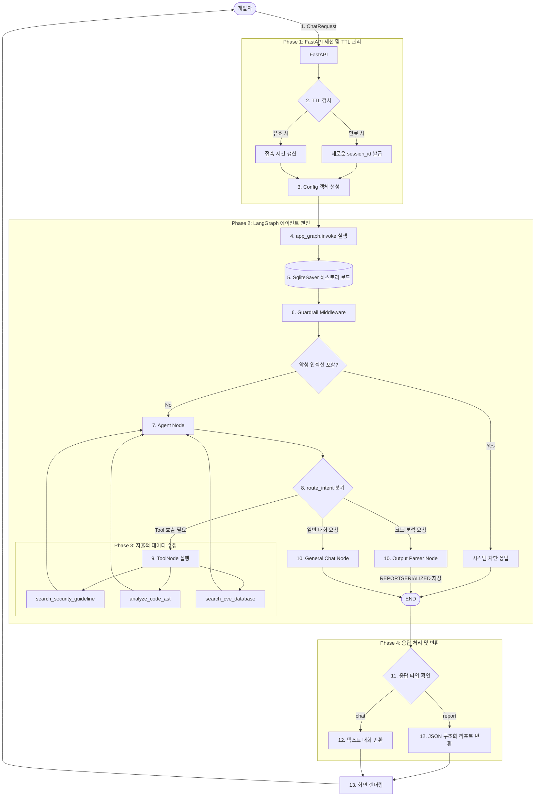

# 🛡️ SecureCode-Agent: LangChain 기반 지능형 보안 점검 시스템

## 1. 서비스 개요 및 시나리오
'SecureCode-Agent'는 개발자가 작성한 소스코드의 보안 취약점을 자동으로 분석하고, KISA 개발보안 가이드 및 OWASP Top 10 기준에 따라 안전한 가이드를 제공하는 지능형 어시스턴트입니다.

* 사용자: 보안을 고려해야 하는 소프트웨어 개발자
* 시나리오: 
    1. 개발자가 자신의 코드를 입력하여 보안 취약점(SQL Injection 등) 분석을 요청합니다.
    2. Agent는 정적 분석(AST 모의 분석)을 수행하고, CVE DB 및 보안 가이드라인을 참조합니다.
    3. 구조화된 리포트(취약점 여부, 위험도, 수정 코드)를 생성하여 안전한 코드로의 전환을 지원합니다.
  

## 2. 시스템 아키텍처 (System Architecture)

본 시스템은 단방향 스크립트가 아닌, 상태를 유지하며 자율적으로 판단하는 **모듈화된 5계층 아키텍처(5-Layer Architecture)**로 설계되었습니다.

### 2.1. 계층별 구성 요소 (Layered Architecture)

1. **통신 및 프레임워크 계층 (Interface & API Layer)**
   * **FastAPI:** 프론트엔드(`index.html`) 정적 파일 서빙 및 `/api/chat` 엔드포인트를 제공하는 경량 웹 서버입니다.
   * **세션 매니저 (Session Manager):** `uuid` 기반의 세션 발급 및 자체적인 TTL(1시간) 타이머를 통해 서버 메모리 누수를 방지하고 대화 세션을 관리합니다.

2. **지식 및 RAG 파이프라인 계층 (Knowledge Base Layer)**
   * **ChromaDB:** 보안 가이드라인(웹 문서 및 PDF)을 임베딩하여 보관하는 로컬 벡터 데이터베이스입니다.
   * **Text Splitter:** `WebBaseLoader`와 `PyPDFLoader`로 수집된 데이터를 `RecursiveCharacterTextSplitter`를 통해 의미가 훼손되지 않는 최적의 크기(1000자)로 분할하여 검색 효율을 높였습니다.

3. **에이전트 코어 계층 (Agent Orchestration Layer - LangGraph)**
   * **StateGraph:** 대화 흐름을 노드(Node)와 엣지(Edge)로 관리하는 핵심 엔진입니다.
   * **Memory (SqliteSaver):** SQLite를 Checkpointer로 사용하여 사용자의 멀티턴 대화 맥락(Context)을 영구적으로 저장하고 복원합니다.
   * **Middleware (Guardrail):** 프롬프트 인젝션 등 악의적 공격을 최우선으로 차단하는 보안 미들웨어입니다.
   * **Smart Router (`route_intent`):** `IntentClassifier`를 통해 사용자의 의도를 분석하고, 일반 챗봇 로직과 코드 분석 로직을 동적으로 분기(Branching)합니다.

4. **외부 도구 연동 계층 (Tool Execution Layer)**
   * 에이전트가 ReAct 패턴에 따라 자율적으로 호출하는 3가지 도구입니다.
   * 정적 코드 분석(`analyze_code_ast`), 벡터 DB 검색(`search_security_guideline`), NVD 실시간 통신(`search_cve_database`).

5. **데이터 구조화 및 출력 계층 (Data & Output Layer)**
   * **Pydantic (SecurityReport):** LLM의 자유로운 텍스트 출력을 통제하고, 반드시 지정된 JSON 형식(취약점 여부, 등급, 설명, 수정 코드)으로 응답하도록 강제합니다.
   * **직렬화기 (Serializer):** 파싱된 JSON 데이터를 DB에 안전하게 보존하기 위해 `REPORTSERIALIZED:` 형태의 문자열로 변환하고 화면에 그릴 때 역직렬화합니다.

### 2.2. 실행 흐름도 (Workflow Diagram)




## 3. 기술 스택 구현 및 실행 흐름 상세 (Execution Flow & Tech Stack)

### Phase 1: 시스템 초기화 및 보안 (보안 및 RAG 파이프라인 구성)
* **환경 변수 관리 (`dotenv`)**: `load_dotenv()`를 사용하여 `.env` 파일에서 `OPENAI_API_KEY`를 안전하게 로드합니다. 이는 서비스 배포 시 발생할 수 있는 보안 취약점을 예방합니다.
* **RAG 파이프라인 구축 (`Chroma`, `WebBaseLoader`, `PyPDFLoader`)**:  에이전트의 환각(Hallucination) 현상을 방지하고 도메인 특화 지식을 제공하기 위해 하이브리드 RAG를 구축했습니다. 
    * OWASP 웹 문서와 KISA 보안 가이드(`kisa_secure_coding_guide.pdf`)를 병합 로드한 뒤, `RecursiveCharacterTextSplitter`를 통해 1000자 단위(overlap 200)로 분할하여 `Chroma` 벡터스토어에 인덱싱했습니다. 
    * 이를 통해 서비스는 일반적인 지식이 아닌, 최신 보안 표준에 입각한 정확한 근거를 검색하여 답변에 반영합니다.

### Phase 2: 요청 수신 및 상태 유지 (세션 및 Memory 관리)
* **세션 기반 메모리 연동 (`FastAPI`, `SqliteSaver`)**: 사용자가 프론트엔드에서 질문을 입력하면, FastAPI 엔드포인트에서 고유한 `session_id`를 발급 또는 식별합니다. 
    * LangGraph의 `SqliteSaver`를 Checkpointer로 사용하여, 이 `session_id`를 기준으로 SQLite DB에서 과거의 멀티턴(Multi-turn) 대화 맥락을 완벽하게 복원합니다.
* **자체 TTL(Time-To-Live) 메모리 최적화**: 실제 서비스 운영 시 발생할 수 있는 메모리 누수를 방지하기 위해 `SESSION_ACCESS_LOG`를 구현했습니다. 1시간(3600초) 이상 미사용된 세션은 자동으로 만료시키고 새로운 세션으로 리셋하여 서버 리소스를 효율적으로 관리합니다.

### Phase 3: 에이전트 라우팅 및 가드레일 (LangGraph 분기 및 Middleware)
* **운영 안정성을 위한 Middleware (`guardrail_middleware`)**: LangGraph의 첫 번째 노드로 가드레일을 배치했습니다. 사용자의 입력에 "해킹해줘"와 같은 악의적 프롬프트 인젝션 시도가 감지되면 시스템이 즉각 개입하여 `[시스템 차단]` 메시지를 반환하고 프로세스를 조기 종료(`END`)시킵니다.
* **조건부 분기(Conditional Edges) 기반 라우팅 (`route_intent`)**: 단순 체인(Chain) 구조가 아닌 `StateGraph`를 활용하여, `IntentClassifier`가 사용자의 전체 문맥을 분석합니다. 
    * 의도가 '코드 분석(analysis)'일 경우 구조화된 리포트를 생성하는 `parser` 노드로 보내고, '단순 대화(general)'일 경우 `general_chat` 노드로 분기시킵니다. 이 동적 라우팅을 통해 불필요한 연산을 줄이고 응답 속도를 최적화했습니다.

### Phase 4: 자율적 데이터 수집 (Tool Calling)
* **다중 도구 자율 선택 (`bind_tools`)**: 에이전트는 분석에 필요한 데이터가 부족할 경우, 시스템에 장착된 3개의 외부 도구 중 최적의 도구를 스스로 판단하여 호출합니다.
    1.  `analyze_code_ast`: 정규식 및 패턴 매칭을 통해 1차적인 코드 정적 분석을 수행합니다.
    2.  `search_security_guideline`: RAG 파이프라인의 Retriever를 호출하여 취약점 방어 기법을 검색합니다.
    3.  `search_cve_database`: 실시간으로 NVD 데이터베이스 API에 접근하여 해당 기술 스택의 최신 CVE(알려진 취약점) 정보를 수집합니다. 타임아웃 예외 처리를 통해 API 지연 시에도 서비스가 멈추지 않도록 구성했습니다.

### Phase 5: 응답 구조화 및 데이터 직렬화 (OutputParser)
* **구조화된 출력 (`Pydantic`, `with_structured_output`)**: 코드 분석이 완료되면, 에이전트가 자유 형식으로 대답하는 것을 통제하기 위해 `SecurityReport` Pydantic 스키마를 강제합니다. 
    * 이 과정을 통해 취약점 발견 여부(Boolean), 위험도(String), 상세 설명(String), 수정된 코드(String)가 완벽한 JSON 형태로 출력되며, 프론트엔드에서 리포트 UI를 안정적으로 렌더링할 수 있습니다.
* **데이터 정합성을 위한 직렬화 (`REPORTSERIALIZED`)**: 반환된 JSON 리포트는 화면에 표시됨과 동시에, `REPORTSERIALIZED:`라는 접두사가 붙은 문자열로 변환되어 DB에 저장됩니다. 향후 세션을 복구할 때 이 접두사를 파싱하여 과거 리포트 내역까지 화면에 온전히 복원해 내는 데이터 정합성을 확보했습니다.


## 4. 실행 가이드 (How to Run)
본 프로젝트를 로컬 환경에서 실행하기 위한 단계별 지침입니다.

### 4-1. 준비 환경
```text
my-project/ (루트 디렉토리)
├── .env                <-- API 키 관리 
├── main.py             <-- 실행 파일
├── agent.py            <-- 에이전트 로직
├── requirements.txt    <-- 의존성 파일
├── kisa_secure_coding_guide.pdf    <-- RAG 검색용 보안 가이드 문서
├── README.md           <-- 작성한 설명서
└── static/             <-- 서브 폴더
    └── index.html      <-- 프론트엔드 파일
```

### 4-2. 사전 준비 (Prerequisites)
* 프로젝트 구동을 위해 최상위(Root) 디렉토리에 다음 두 파일이 반드시 존재해야 합니다.
    1. .env : API 키 환경 변수 파일 (생성 필요)
    2. kisa_secure_coding_guide.pdf : RAG 벡터 검색용 가이드 문서 (폴더 내 위치 확인)
       
### 4-3. 환경 설정 및 서버 실행
* Step 1. (권장) 가상환경 생성 및 활성화
* Step 2. 필수 라이브러리 설치 (pip install -r requirements.txt)
* Step 3. FastAPI 서버 구동 (uvicorn main:app --reload)
  
### 4-4. 서비스 접속 및 테스트 시나리오
* 서버 구동 후, 웹 브라우저에서 http://127.0.0.1:8000/ 로 접속하여 다음 시나리오를 테스트하세요. (본 프로젝트는 배포가 되어있지 않으니 로컬에 설치하여 진행해야 합니다.)
    1. 보안 점검 테스트 - 에이전트가 코드를 분석하고, RAG와 CVE 검색을 수행한 뒤 구조화된 리포트를 반환합니다.
    2. 일반 챗봇 라우팅 테스트 - 의도를 파악하여 분석 리포트가 아닌 일반적인 대화로 응답합니다.
    3. 가드레일 방어 테스트 (ex. 해킹해줘, 공격 코드 작성해줘) - Middleware가 차단하여 즉시 시스템 경고 메시지를 띄웁니다.


## 5. 프로젝트 느낀점 및 향후 개선 방향 

이번 과제를 통해 인공지능 에이전트를 처음으로 직접 구현해 보면서 정말 많은 것을 배웠습니다. 하지만 아직 AI와 백엔드 지식이 부족하여 과제를 진행하며 여러 한계에 부딪혔습니다. 아래에는 프로젝트의 개선 방향 앞으로 더 공부해보고 싶은 점들을 정리해 보았습니다.

**1. 코드 분석 기능의 아쉬움**
* **한계점:** 현재 코드를 분석할 때, 단순히 'SELECT' 같은 특정 단어나 기호가 있는지 문자열을 찾는 수준으로만 구현했습니다. 그러다 보니 코드가 조금만 복잡해지거나 꼬여 있으면 취약점을 제대로 찾아내지 못하는 한계가 있었습니다.
* **개선 방향:** 파이썬 내장 `ast` 모듈을 활용해 Abstract Syntax Tree를 직접 순회하며 분석하거나, 실무에서 활용되는 오픈소스 SAST 엔진을 연동하여 에이전트가 훨씬 더 정밀한 분석을 할 수 있도록 고도화하고 싶습니다.
  
**2. RAG 청크 분할 방식의 한계**
* **한계점:** 보안 가이드라인 문서를 AI에게 먹일 때, 그냥 1000글자씩 청크해서 넣는 방식을 택했습니다. 그러나 이는 문서를 읽음에도 안정성 있는 보안 해결책 답변을 제공하기 어려다는 것을 느꼈습니다.
* **개선 방향:** AI가 문서를 잘 이해하려면 그냥 글자 수로 막 자르면 안 된다는 걸 느꼈습니다. 문맥의 의미를 파악해 분할하는 `Semantic Chunking` 기법을 적용해 할루시네이션을 더 확실히 잡고 싶습니다.

**3. 단일 파일 DB(SQLite)의 동시성 및 아키텍처 확장 문제**
* **한계점:** 에이전트의 세션 상태와 대화 이력을 영구 보존하기 위해 `SqliteSaver`를 채택했습니다. DB Lock 방지를 위해 FastAPI 엔드포인트를 동기로 구성하여 안정성은 확보했으나, 다중 사용자 환경에서는 트래픽 병목 현상이 발생할 수밖에 없는 구조입니다.
* **개선 방향:** 실제 상용 서비스 트래픽을 가정하여 세션 및 TTL 관리를 인메모리 데이터 스토어인 `Redis`로 마이그레이션하고, I/O 바운드 작업들을 비동기(Async) 처리로 리팩토링하여 시스템의 동시성(Concurrency) 처리 능력을 개선하고 싶습니다.

**마치며:**
LLM API를 단순히 호출하는 것을 넘어, Guardrail 설정, Pydantic을 통한 구조화된 데이터 파싱, 그리고 사용자 의도에 맞춘 동적 라우팅(Conditional Routing)까지 전체 파이프라인을 직접 통제해 보는 값진 경험이었습니다. 그리고 현재 보안전문가의 진로를 희망하고 있는데, AI로 보안 서비스를 제공하는 것도 가능할 수 있겠다는 가능성을 직접 경험하면서 깨달을 수 있었습니다. 이후에 AI에 대해 더 공부하고 개발 경험을 늘려 현재 프로젝트를 기반으로 더 완벽한 보안 AI agent 서비스를 개발하고 싶습니다.
